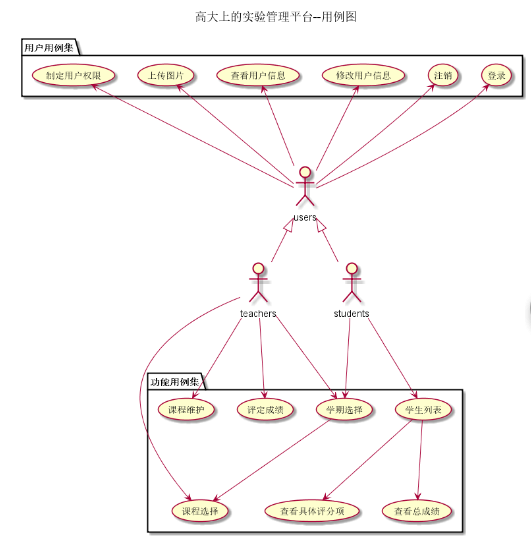
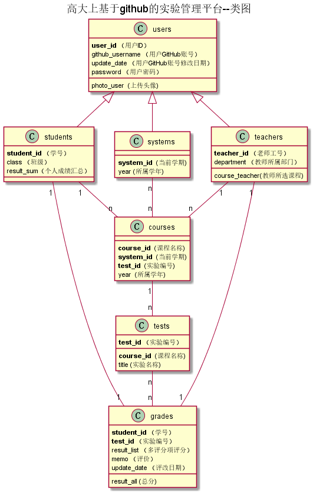

# 基于GitHub的实验管理平台的分析与设计

|    学号   |       班级       |      姓名     |
|:-------:|:------------- | ----------:|
|   201510414106  |     软工1班     |   费浩然   |

## 1.概述
* 基于GitHub的实验管理平台的作用是在线管理实验成绩的Web应用系统。学生和老师的实验内容均存放在Github页面上。
* 学生的主要功能：管理自己的用户平台，查看个人的实验成绩（包括每一个评分项），不公开成绩，仅自己可查看。
* 老师的主要功能：包括批改成绩与查看学生成绩两项。
* 通过这个管理平台，学生和老师可各自查看每个学生的github管理目录，以便查阅成绩，修改成绩。
* 学生的实验成绩按照多评分项的总和计算。
* 学生的实验成绩总分为100分，不合格者低于60分。最低0分。
 

## 2.系统总体结构

界面设计参见： https://fmodric.github.io/is_analysis/test6/ui/学生列表.html
## 3.用例图设计 [源码](src/useCase.puml)

## 4.类图设计[源码](src/class.puml)

## 5.数据库设计
* [参见数据库文件设计](./数据库文件设计.md)

## 6.用例及界面详细设计
* ["学生列表"用例](用例/学生列表.md) ， [界面](https://fmodric.github.io/is_analysis/test6/ui/学生列表.html)
* ["学期选择"用例](用例/学期选择.md) ， [界面](ui/学期选择.html)
* ["评定成绩"用例](用例/评定成绩.md) ， [界面](ui/评定成绩.html)
* ["课程选择"用例](用例/课程选择.md) ， [界面](ui/课程选择.html)
* ["查看总成绩"用例](用例/查看总成绩.md) ， [界面](ui/查看总成绩.html)
* ["查看具体评分项"用例](用例/查看具体评分项.md) ， [界面](ui/查看具体评分项.html)
* ["登录"用例](用例/登录.md) ， [界面](ui/index.html)
* ["注销与登出"用例](用例/注销与登出.md) ， [界面](ui/注销与登出.html)
* ["查看用户信息"用例](用例/查看用户信息.md) ， [界面](ui/查看用户信息.html)
* ["修改用户信息"用例](用例/修改用户信息.md) ， [界面](ui/修改用户信息.html)
* ["上传图片"用例](用例/上传图片.md) ， [界面](ui/上传图片.html)
* ["指定用户权限"用例](用例/指定用户权限.md) ， [界面](ui/指定用户权限.html)
