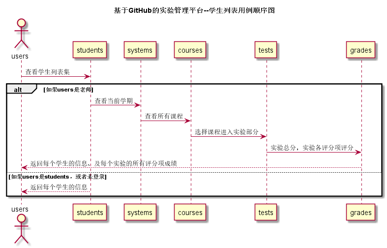

# “学生列表”用例 [返回](../README.md)

## 1.用例规约

|用例名称|学生列表|
|:---:|:--:|
|功能|所有用户进入即可看见的主页，以表的形式显示出所有学生的信息|
|参与者|学生与老师（未登录者不可查看学生列表）|
|前置条件|学生，老师需要先登录|
|后置条件||
|主事件流||
|备选事件流||
## 2.业务流程 [源码](../src/studentSequence.puml)

## 3.界面设计
1. 界面参照：
2. API接口调用 
    * 接口-1: [getStudents](../接口/getStudents.md)

## 4.算法描述
1. RESULT_SUM解析为列表
    * RESULT_SUM是接口getStudents的返回值中的一个键值对，形如："RESULT_SUM": "100,82,35,70,N"。需要在前端进行解析。
    * 成绩各科的显示，以逗号隔开，各栏显示为各科的成绩分数，N表示未批改。
    * 算法使用字符串分隔法将值划分。
2. PHOTO_USER解析为二进制流
    * PHOTO_USER是接口getStudents的返回值中的一个键值对，形如："PHOTO_USER": "001256"。需要在前端进行解析。
    * 算法把图片转成 Byte型 二进制流，再把二进制流读入缓冲区即可。
## 5.参照表
* [students](../数据库文件设计.md)
* [systems](../数据库文件设计.md)
* [courses](../数据库文件设计.md)
* [tests](../数据库文件设计.md)
* [grades](../数据库文件设计.md)
