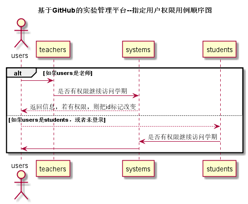

# “指定用户权限”用例 [返回](../README.md)

## 1.用例规约

|用例名称|指定用户权限|
|:---:|:--:|
|功能|对用户权限进行设置，包括学生信息，教师信息，课程对外是否允许访问等|
|参与者|学生与老师|
|前置条件|学生，教师进入修改用户信息，查看权限设置|
|后置条件||
|主事件流||
|备选事件流||
## 2.业务流程 [源码](../src/userPermission.puml)

## 3.界面设计
1. 界面参照：
2. API接口调用 
    * 接口-1 [userPermission](../接口/userPermission.md)

## 4.算法描述

无

## 5.参照表
* [SYSTEMS](../数据库文件设计.md)
* [TEACHERS](../数据库文件设计.md)
* [STUDENTS](../数据库文件设计.md)
* [COURSES](../数据库文件设计.md)
* [USERS](../数据库文件设计.md)
