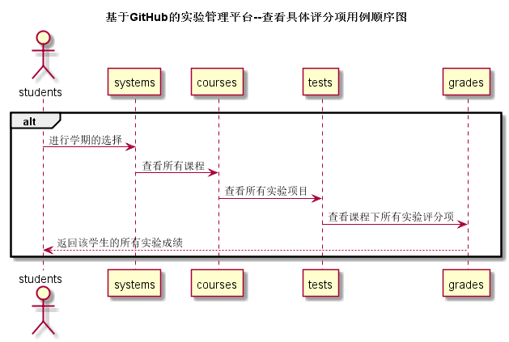

# “查看具体评分项”用例 [返回](../README.md)

## 1.用例规约

|用例名称|查看具体评分项|
|:---:|:--:|
|功能|查看学生单学期的某一课程的所有实验成绩及评分项|
|参与者|学生与老师|
|前置条件|进入学生列表，再进入学生用户信息，选择某学期下的某一课程|
|后置条件||
|主事件流|
1. 进入学生列表

2. 查看用户信息

3. 选择学期

4. 选择课程

5. 查看实验成绩及评分
|
|备选事件流|
1a. 查看实验成绩及评分是教师还未给予评分

1. 提示教师尚未评语，请几日后再查看

2a. 不选择学期，直接点击查看总成绩

1. 提示请进行学期勾选
|
## 2.业务流程 [源码](../src/specificScore.puml)

## 3.界面设计
1. 界面参照：[界面参照](../数据库文件设计.md)
2. API接口调用 
    * 接口-1 [getOneStudentViewResult](../接口/getOneStudentViewResult.md)

## 4.算法描述

无

## 5.参照表
* [STUDENTS](../数据库文件设计.md)
* [COURSES](../数据库文件设计.md)
* [GRADES](../数据库文件设计.md)
* [TESTS](../数据库文件设计.md)
