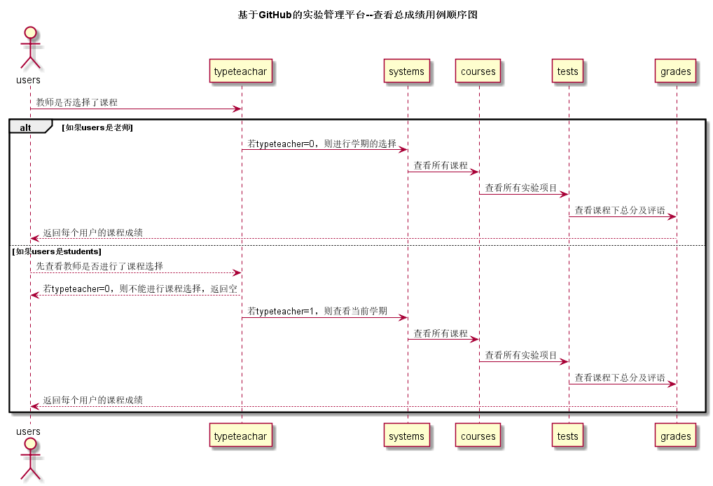

# “查看总成绩”用例 [返回](../README.md)

## 1.用例规约

|用例名称|查看总成绩|
|:---:|:--:|
|功能|查看学生的所有课程成绩，用列表形式呈现|
|参与者|学生与老师|
|前置条件|进入学生列表，再进入学生用户信息|
|后置条件||
|主事件流|
1. 进入学生列表

2. 查看用户信息

3. 选择学期

4. 查看总成绩

|
|备选事件流|
1a. 无权限查看用户信息

1. 提示请登录教师用户进行查看

2a. 不选择学期，直接点击查看总成绩

1. 提示请进行学期勾选
|
## 2.业务流程 [源码](../src/overResult.puml)

## 3.界面设计
1. 界面参照：
2. API接口调用 
    * 接口-1 [getOneStudentResults](../接口/getOneStudentResults.md)

## 4.算法描述

无

## 5.参照表
* [SYSTEMS](../数据库文件设计.md)
* [TEACHERS](../数据库文件设计.md)
* [STUDENTS](../数据库文件设计.md)
* [COURSES](../数据库文件设计.md)
* [GRADES](../数据库文件设计.md)
* [TESTS](../数据库文件设计.md)
