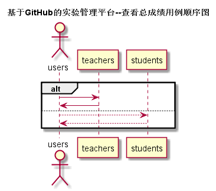

# “查看用户信息”用例 [返回](../README.md)

## 1.用例规约

|用例名称|查看用户信息|
|:---:|:--:|
|功能|用户自己的相关信息展示|
|参与者|学生与老师|
|前置条件|学生，老师需要先登录|
|后置条件|可选择继续查看具体评分项|
|主事件流||
|备选事件流||
## 2.业务流程 [源码](../src/findUserinfo.puml)

## 3.界面设计
1. 界面参照：
2. API接口调用 
    * 接口-1 [getUserinfo](../接口/getUserinfo.md)

## 4.算法描述

## 5.参照表
* [TEACHERS](../数据库文件设计.md)
* [STUDENTS](../数据库文件设计.md)
* [USERS](../数据库文件设计.md)
