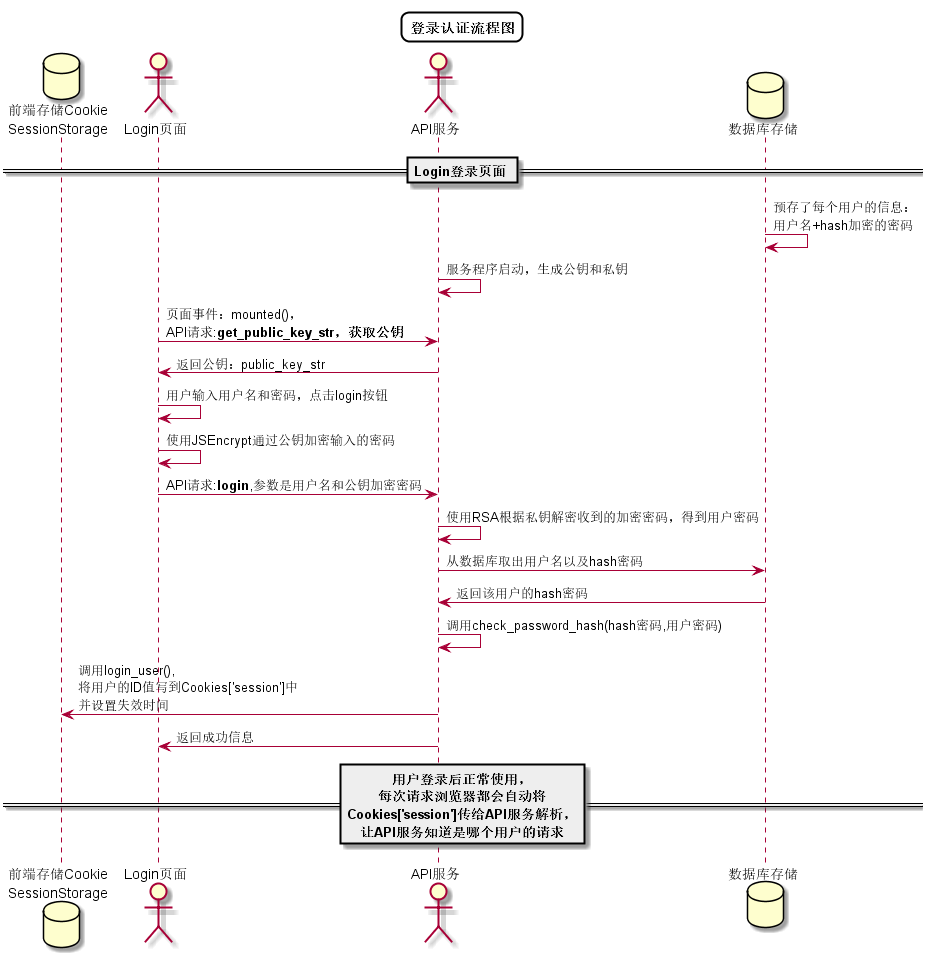

# “登录”用例 [返回](../README.md)

## 1.用例规约

|用例名称|登录|
|:---:|:--:|
|功能|用户进行登录|
|参与者|学生与老师|
|前置条件||
|后置条件|登录成功，则跳转到主页|
|主事件流|
1. 访客输入用户名密码
 
2.选择用户类型
 
3. 系统判断用户名密码，若正确，则允许登录
 
4. 系统在客户端以Cookie形式存储登录用户信息，保持登录的持久性
|
|备选事件流|
1a . 输入的用户名或密码为空
 
1.提示用户名或密码不能为空
 
2.提示请重新输入
 
3.访客重新提交用户信息
 
4.页面跳转
   
2a. 用户输入的用户名或密码错误
 
1.提示用户名或密码错误
 
2.提示请重新输入
 
3.访客重新提交用户信息
 
4.页面跳转
|
## 2.业务流程 

无

## 3.界面设计
1. 界面参照：https://fmodric.github.io/is_analysis/test6/ui/index.html
2. API接口调用 
    * 接口-1 [login](../接口/login.md)

## 4.算法描述 [源码](../src/login.puml)

## 5.参照表
* * [USERS](../数据库文件设计.md)
