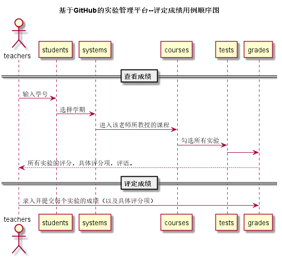

# “评定成绩”用例 [返回](./README.md)

## 1.用例规约

|用例名称|评定成绩|
|:---:|:--:|
|功能|教师评定学生的课程实验成绩|
|参与者|教师|
|前置条件|教师先登录，并且进入学生列表，显示学生的所有课程，并且进入该老师所执教的课程,显示打分栏和评语栏。|
|后置条件|提交成绩后，系统自动计算该课程的平均成绩。|
|主事件流|
1. 查看课程

2. 查看已有成绩

3. 输入成绩和评语

4. 提交

5. 系统存储提交数据

6.系统自动计算平均成绩
|
|备选事件流|
1a. 成绩分数必须在0-100分以内

1.提示重新输入分数

2a. 评语字数限制在140字以内

1. 提示字数超出140字
|
## 2.业务流程 [源码](../src/reviewResult.puml)

## 3.界面设计
1. 界面参照：
2. API接口调用 
    * 接口-1 [getNextPrevStudent](../接口/getNextPrevStudent.md)
      
用于取得上一个或者下一个学生的学号

    * 接口-2 [getOneStudentSystems](../接口/getOneStudentSystems.md)
      
用于显示一个学生的所有学期及课程

    * 接口-3 [setOneStudentResults](../接口/setOneStudentResults.md)
      
用于设置一个学生单学期的部分实验成绩和评语

    * 接口-4 [getOneStudentResults](../接口/getOneStudentResults.md)
      
用于显示一个学生的单学期所有实验课程和评语

    * 接口-5 [getOneStudentViewResult](../接口/getOneStudentViewResult.md)
      
用于显示一个学生的单个课程的所有实验项评分

## 4.算法描述

无

## 5.参照表
* [STUDENTS](../数据库文件设计.md)
* [COURSES](../数据库文件设计.md)
* [GRADES](../数据库文件设计.md)
* [TESTS](../数据库文件设计.md)
* [SYSTEMS](../数据库文件设计.md)