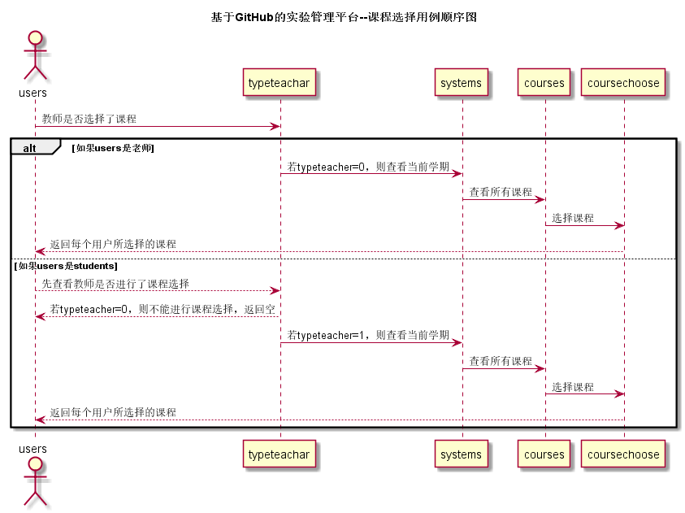

# “课程选择”用例 [返回](./README.md)

## 1.用例规约

|用例名称|课程选择|
|:---:|:--:|
|功能|显示所有课程，按学期进行划分，由学生与教师进行选择|
|参与者|学生与教师（未登录者不可查看课程选择）|
|前置条件|学生，老师需要先登录，选择了学期。|
|后置条件|选择课程后，课程状态显示已被选择（打勾）|
|主事件流| 1. 选择学期 2.在所修课程前进行勾选 3. 提交 4.  系统进行数据存储|
|备选事件流|提示课程选择不能全为空|
## 2.业务流程 [源码](../src/courseChoose.puml)

## 3.界面设计
1. 界面参照：
2. API接口调用 
    * 接口-1:[getTypeTeacher](../接口/getTypeTeacher.md)

## 4.算法描述
无
## 5.参照表
* [USERS](../数据库文件设计.md)
* [SYSTEMS](../数据库文件设计.md)
* [COURSES](../数据库文件设计.md)